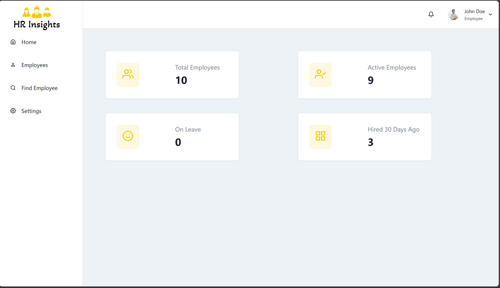
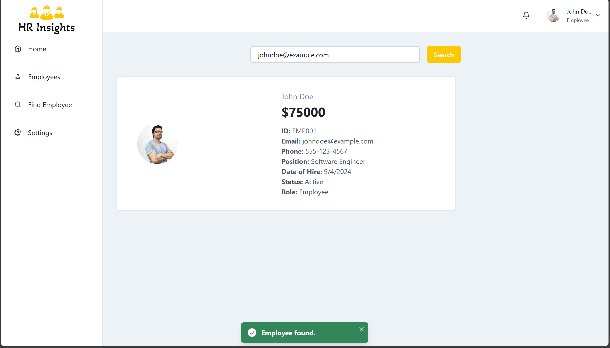

# Overview
This is a full-stack HR Insights project that allows managing employee data, including CRUD operations (Create, Read, Update, Delete), as well as file uploads for employee profile pictures. The system also supports different account roles (HR Administrator, Employee) to allow users with specific permissions to access different functionalities.

## Project Components
- Backend: .NET Core API to handle employee data, authentication, and business logic.
- Database: SQL Server for storing employee data, user accounts, and other relevant information.
- Frontend: React.js + Chakra UI application to provide an interactive UI for managing the system.

## Features
- Employee Management (CRUD)
- User Authentication
- Role-based Access Control (HR Administrator, Employee)
- File Upload for Employee Photos (Does not work)

## Getting Started

### Prerequisites
- .NET SDK 6.0 or later
- SQL Server 2019 or later
- Node.js and npm
- React.js for frontend development

### Setting Up the Backend (.NET Core)
1. Clone the repository
2. Set Up the .NET Server
3. Navigate to the backend project folder where the .csproj file is located.

4. Install the required packages:
dotnet restore

5. Open the appsettings.json file and update the SQL Server connection string to point to your SQL Server instance:
{
  "ConnectionStrings": {
    "DefaultConnection": "Server=your_server_name;Database=HRInsightsDatabase;Trusted_Connection=True;"
  }
}

6. Run the migrations to set up the database schema:

- dotnet ef database update
7. Run the .NET Core server:
- dotnet run
The server should now be running on https://localhost:5219/ (or the URL specified in launchSettings.json).

### Setting Up the SQL Server Database

1. Create Database: First, create a new SQL Server database named HRInsightsDatabase. This should have been done if the migrations were ran successfully

2. Run the Insert Statements provided in the project directory @insert_statements.sql

### Setting Up the Frontend (React.js)
1. Install Node.js Dependencies
Navigate to the project folder and run the following commands:
npm install

2. Start the Frontend Application
npm run dev

### Logging in to the Application
Here are two accounts you can use to test the login functionality:

- HR Administrator Account
Email: janesmith@example.com
Password: hashed_password_2

- Employee Account
Email: johndoe@example.com
Password: hashed_password_1

These accounts have been seeded into the Users table.

### Final Notes
There are some bugs that need to be ironed out but I ran out of time 

Employee Photos: Make sure that the photos are located in the public/uploads folder on your server.

Security: Ensure that password hashes are stored securely in production, and replace the sample hashed passwords with actual secure hashed values.

### Screenshots

